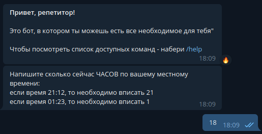
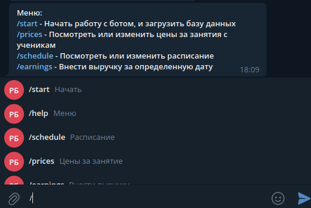
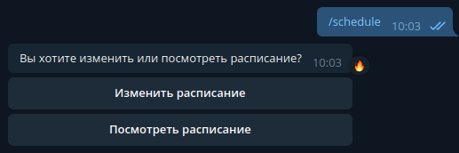
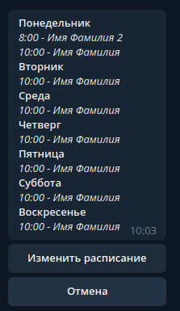
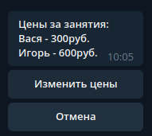
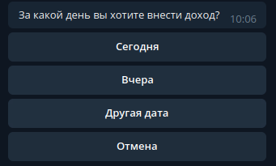

<a href="https://wakatime.com/badge/user/018c3f04-b140-41f9-a489-5b0143d153f5/project/018c3f0a-67fd-4676-b0c5-0d957fc0e58f"></a>

# Телеграм бот-помощник для репетиторов

## Используемые фреймворки и библиотеки

<ul>
<li><strong>Asyncio</strong></li>
<li><strong>Aiogram</strong></li>
<li><strong>MongoDB</strong></li>
<li><strong>Docker</strong></li>
</ul>

## Функционал

#### 1. Регистрация в телеграм боте, сохранение часового пояса



#### 2. Меню (команды или кнопки)



#### 3. Внесение и изменение в базу данных(MongoDB) расписания




#### 4. Внесение и изменение в базу данных цен за занятие и ежедневной выручки (если какое-либо занятие отменилось)




## Установка

#### 1. Перейти в корневой каталог репозитория telegram_bot_for_teacher

#### 2. Изменить файл .env

```Shell
# Токен от телеграм-бота, можно узнать у @BotFather
BOT_TOKEN=4953143451:AAGx7qR08wetykzye7N8doWVWy66rurKGY 

# Id админа для телеграм-бота, можно узнать у @userinfobot
ADMIN_IDS=173901673

# URL от базы данных
URL="mongodb://localhost:27017"
```   

#### 3. Запустить контейнеры

```Shell
sudo docker-compose up -d --build
```
